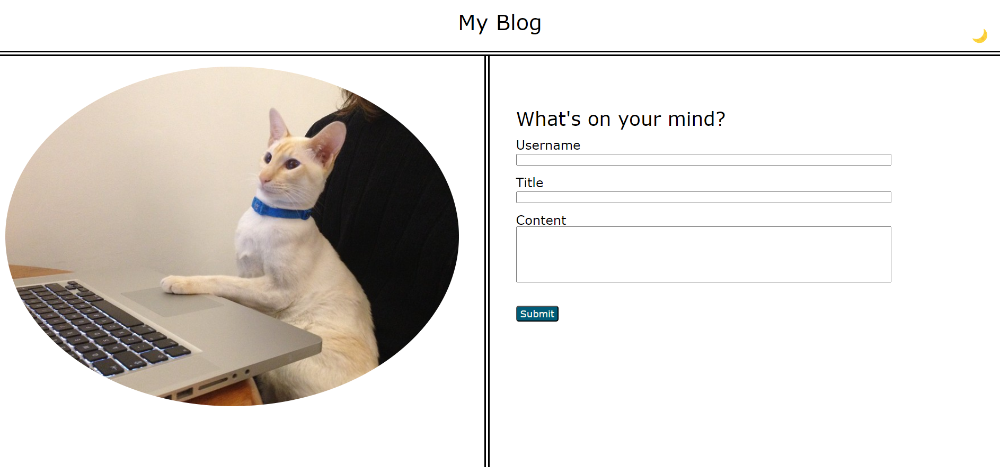
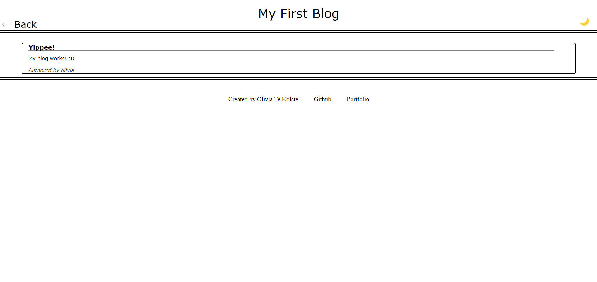
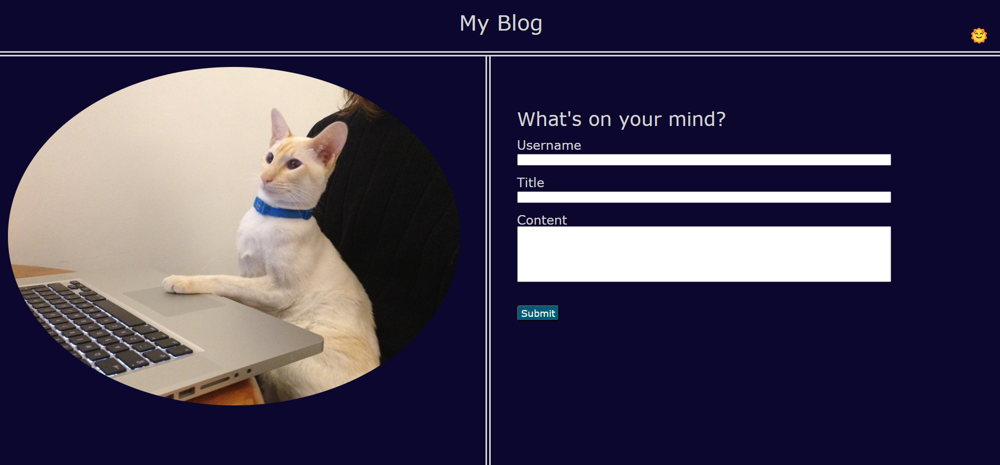

# Personal Blog

## Description

I built this simple personal blog page as a means of practicing Javascript, particularly in regards to using local storage via JSON, in addition to continuing to practice the basics of HTML and CSS. Creating this project allowed me to gain experience in creating and using objects in javascript, storing those objects in arrays, and storing/retrieving those arrays as needed using the browser's local storage. Importantly, it also prompted me to practice using javascript in order to create and manipulate HTML elements - in this case, by retreiving the array of blog posts and rendering them on the webpage, as well as by creating a light/dark toggle mode! 

In short, creating this site enabled me to practice constructing a responsive site that could store and retrieve items and alter the HTML as necessary, a vital skill for web development in the industry.

## Usage

To use, go [here](otekolste.github.io/personal-blog/blog.html). 

Input an username, title, and some content and submit it to be redirected to the next page. Note that if you are missing any of this information, an alert will pop up to ask you to try again.

The next page will display the blog post you have just created!

From this page, you can go back to the landing page and create more posts. Each time, your post will be added to the next page!

To clear the list of posts, on the blog page, in Google Chrome, right click -> "inspect" -> Application (on the top menu of the sidebar) -> "Local Storage" (in the sidebar on the left) -> right click on the object entitled "posts" -> Delete.

Each page also has a moon icon in the upper right-hand corner. Clicking this will toggle dark mode.

As demonstrated in the image, the icon will change to a sun, because clicking again will restore the page to light mode.

## Credits

[Cat on computer](https://www.flickr.com/photos/chough/8327120251) - used with Creative Commons license

Javascript code to switch page between light/dark mode referenced from [here](https://www.w3schools.com/howto/howto_js_toggle_dark_mode.asp)

## License

Can be viewed in the root of the directory, in the file entitled LICENSE.